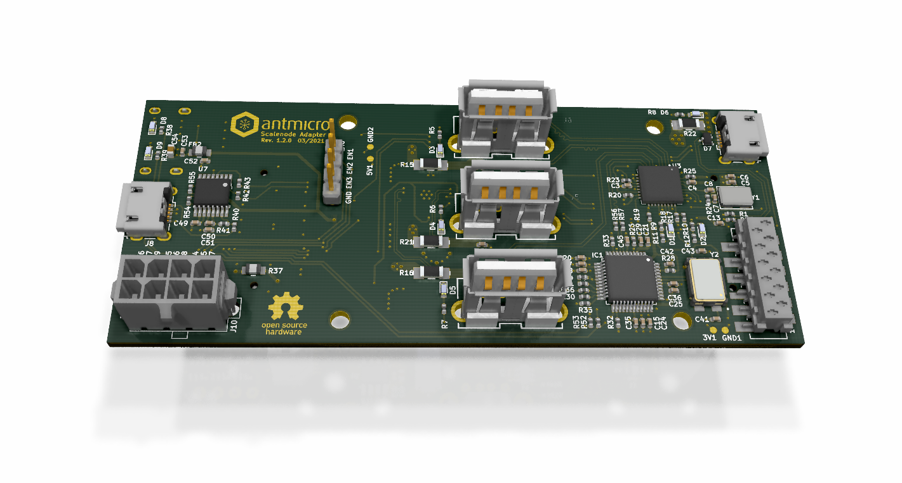

=================
Scalenode Adapter
=================

Copyright (c) 2021 `Antmicro <https://www.antmicro.com>`_

Overview
--------

This repository contains design files of the expansion card for the Antmicro Scalenode platform.
This expansion card exposes three USB host ports with independent supply current monitoring for each port.
This allows for using the Scalenode to interact with external, FPGA-driven evaluation boards such as the Digilent Arty boards.
The design files were prepared in KiCad.
An initial production release for the design was fabricated as prototypes and these are now being tested.

Repository structure
--------------------
The main repository directory contains KiCad PCB project files, a LICENSE and README.
The remaining files are stored in the following directories:

* ``lib`` - contains the component libraries
* ``img`` - contains graphics for this README

Key Features
------------

* Expansion board for the Scalenode module
* Supports up to three Digilet Arty boards
* On-board current measurement circuitry

License
=======

`Apache-2.0 <LICENSE>`_
